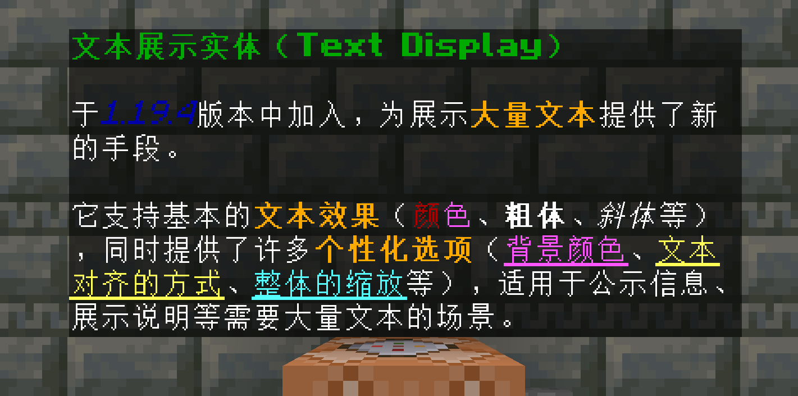

# 文本展示实体生成工具

一个[网页]()，可以比较方便地生成召唤文本展示实体的命令。

## 文本展示实体



```text
/summon minecraft:text_display ~0 ~0.5 ~-0.49 {text:'["", {"text":"文本展示实体（Text Display）", "color":"dark_green","bold":true}, "\\n\\n于", {"text":"1.19.4", "italic":true,"color":"dark_blue"}, "版本中加入，为展示", {"text":"大量文本", "bold":true,"color":"gold"}, "提供了新的手段。\\n\\n它支持基本的", {"text":"文本效果", "bold":true,"color":"gold"}, "（", {"text":"颜", "color":"dark_red"}, {"text":"色", "color":"light_purple"}, "、", {"text":"粗体", "bold":true}, "、", {"text":"斜体", "italic":true}, "等），同时提供了许多", {"text":"个性化选项", "bold":true,"color":"gold"}, "（", {"text":"背景颜色", "underlined":true,"color":"light_purple"}, "、", {"text":"文本对齐的方式", "underlined":true,"color":"yellow"}, "、", {"text":"整体的缩放", "underlined":true,"color":"aqua"}, "等），适用于公示信息、展示说明等需要大量文本的场景。"]', brightness:{block:15,sky:15}, background:-1778384896, alignment:"left", see_through:true, width:1f, height:1f, view_range:0.5f}
```

## 说明

* 将鼠标移动到下面有点点线的文本上，会显示对应的提示信息。
* 如果情况允许，可以仅通过`距离系数`来进行剔除，以减少工作量。
* `文本跨越方块的数量 * 40`可以粗略得出文本的宽度，以供`行宽`参考。
* 不喜欢内置的富语言编辑器？可以在`文本`栏中粘贴外部的富语言文本（不保证能够编辑或是生成），或者直接在`命令`栏中修改`text`
  的值。

## 其他用法

* 纯色背景：将`文本不透明度`调为`0`，并将`背景颜色`调为所需的颜色。
* 标记点：勾选`隔墙可见`，并将`背景`的不透明度调为`0`，将`固定轴`设为`center`，适当调整`文本不透明度`和`剔除条件`。
* ......
